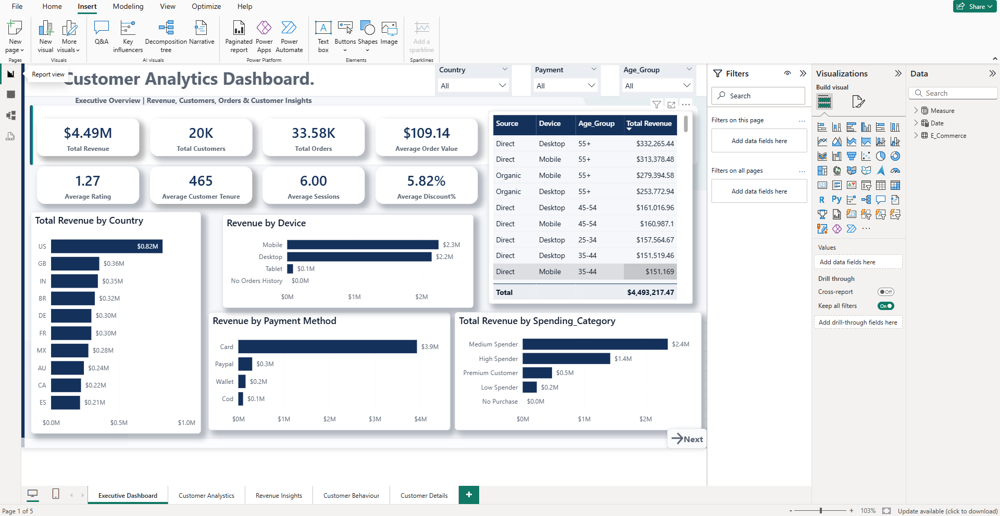
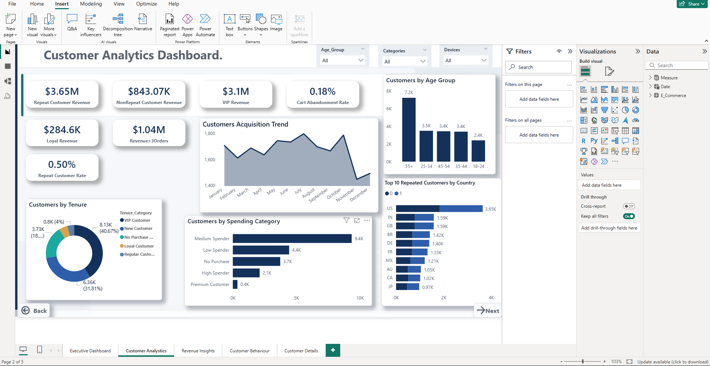
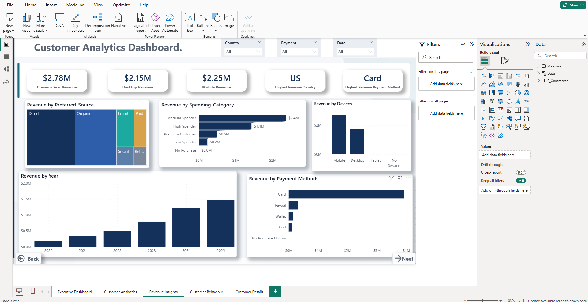
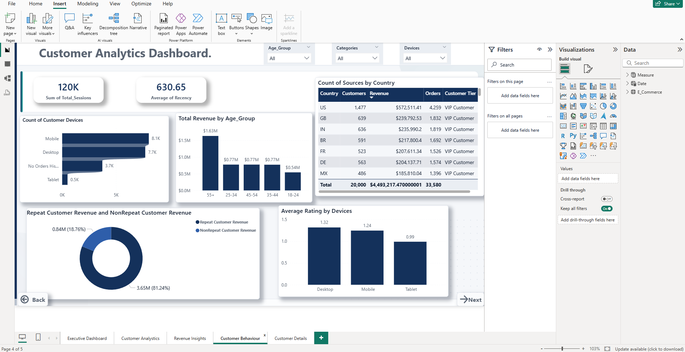
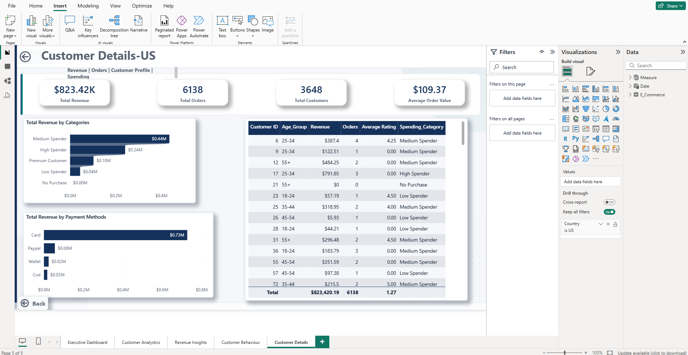

# Customer-Analytics-Dashbaord
# 📊 Customer Analytics Dashboard

An end-to-end **Customer Analytics Dashboard** built using **Power BI, SQL, Python, and DAX** to analyze customer behavior, revenue trends, purchasing patterns, and business performance. The dashboard provides interactive insights through KPIs, drill-through functionality, cross-filtering, and dynamic visualizations to support data-driven business decisions.

---

# 🚀 Project Overview

Understanding customer purchasing behavior is essential for improving customer retention and increasing revenue. This project analyzes customer transaction data to uncover valuable business insights regarding:

- Customer Revenue
- Customer Segmentation
- Spending Categories
- Customer Behavior
- Device Usage
- Payment Preferences
- Revenue Trends
- Customer Retention

The dashboard is designed for executives and business analysts to monitor KPIs and explore customer data interactively.

---

# 🛠️ Tools & Technologies

- **Power BI**
- **Power Query**
- **DAX**
- **SQL**
- **Python**
- **Pandas**
- **NumPy**
- **Matplotlib**
- **Git**
- **GitHub**

---

# 📂 Project Workflow

```
Raw Dataset
      │
      ▼
Python Data Cleaning
      │
      ▼
SQL Data Analysis
      │
      ▼
Power BI Data Modeling
      │
      ▼
DAX Calculations
      │
      ▼
Interactive Dashboard
      │
      ▼
Business Insights
```

---

# 📊 Dashboard Pages

## 1️⃣ Executive Dashboard

Provides a high-level overview of business performance using key metrics.

### KPIs

- Total Revenue
- Total Customers
- Total Orders
- Average Order Value
- Average Rating
- Average Customer Tenure
- Average Sessions
- Average Discount %

### Visualizations

- Top Countries by Revenue
- Revenue by Device
- Revenue by Payment Method
- Revenue by Spending Category
- Revenue Summary Table

---

## 2️⃣ Customer Analytics

Analyzes customer demographics and customer segments.

### KPIs

- Repeat Customer Revenue
- Non-Repeat Customer Revenue
- VIP Revenue
- Loyal Revenue
- Repeat Customer Rate
- Revenue > 3 Orders
- Cart Abandonment Rate

### Visualizations

- Customer Acquisition Trend
- Customers by Age Group
- Customers by Spending Category
- Customers by Tenure
- Top 10 Countries by Repeat Customers

---

## 3️⃣ Revenue Insights

Provides detailed revenue analysis across different business dimensions.

### KPIs

- Previous Year Revenue
- Mobile Revenue
- Desktop Revenue
- Highest Revenue Country
- Highest Revenue Payment Method

### Visualizations

- Revenue by Country
- Revenue by Device
- Revenue by Spending Category
- Revenue by Payment Method
- Revenue by Year
- Revenue Distribution (Treemap)

---

## 4️⃣ Customer Behaviour

Focuses on customer engagement and purchasing behavior.

### KPIs

- Total Sessions
- Average Recency

### Visualizations

- Customer Devices
- Revenue by Age Group
- Average Rating by Device
- Repeat vs Non-Repeat Revenue
- Payment Method Analysis

---

## 5️⃣ Customer Details (Drill-through)

Interactive drill-through page displaying customer-level details.

### KPIs

- Total Revenue
- Total Orders
- Total Customers
- Average Order Value

### Customer Table

- Customer ID
- Revenue
- Orders
- Average Rating
- Spending Category
- Age Group

Users can drill through from the Executive Dashboard to view detailed customer information for a selected country.

---

# ⚙️ Data Preparation

The dataset was cleaned and transformed using **Python** before importing into Power BI.

Data preparation included:

- Handling Missing Values
- Removing Duplicates
- Correcting Data Types
- Feature Engineering
- Data Formatting
- Creating Customer Segments
- Creating Age Groups
- Creating Spending Categories

---

# 🗄 SQL Analysis

SQL was used to perform analytical queries including:

- Revenue Analysis
- Customer Analysis
- Order Analysis
- Payment Method Analysis
- Country-wise Revenue
- Device Analysis
- Customer Segmentation
- Aggregate Reporting

---

# 📈 DAX Measures

The dashboard includes several custom DAX measures such as:

- Total Revenue
- Total Orders
- Total Customers
- Average Order Value
- Mobile Revenue
- Desktop Revenue
- Previous Year Revenue
- Revenue Contribution
- Repeat Customer Revenue
- Non-Repeat Customer Revenue
- VIP Revenue
- Loyal Revenue
- Average Sessions
- Average Recency
- Highest Revenue Country
- Highest Revenue Payment Method

---

# ✨ Dashboard Features

- Interactive Slicers
- Cross Filtering
- Drill-through Navigation
- Edit Interactions
- Navigation Buttons
- Dynamic KPIs
- Responsive Visualizations
- Custom Theme
- Time Intelligence
- Customer Segmentation

---

# 📸 Dashboard Preview

## Executive Dashboard



---------------------------------------------------------------------

## Customer Analytics



---------------------------------------------------------------------

## Revenue Insights



---------------------------------------------------------------------

## Customer Behaviour



---------------------------------------------------------------------

## Customer Details



---------------------------------------------------------------------

# 📁 Repository Structure

```
Customer-Analytics-Dashboard/
│
├── Project Images/
│
├── SQL Queries/
│
├── Python/
│   └── data_cleaning.ipynb
│
├── Dataset/
│   └── ecommerce_cleaned.csv
│
├── Power BI/
│   └── Customer_Analytics_Dashboard.pbix
│
└── README.md
```

---

# 💡 Key Business Insights

- Identified the highest revenue-generating countries.
- Compared revenue across different devices.
- Analyzed customer spending categories.
- Measured repeat customer contribution.
- Evaluated payment method preferences.
- Monitored customer acquisition trends.
- Compared mobile and desktop revenue.
- Explored customer behavior across age groups.
- Provided drill-through customer-level analysis.

---

# 🎯 Skills Demonstrated

- Data Cleaning
- Data Transformation
- SQL Query Writing
- Python Data Analysis
- Power Query
- Data Modeling
- DAX
- Time Intelligence
- Dashboard Design
- Business Intelligence
- Interactive Reporting
- Data Storytelling

---

# 👤 Author

**Swagath**

If you found this project useful, feel free to ⭐ this repository.
